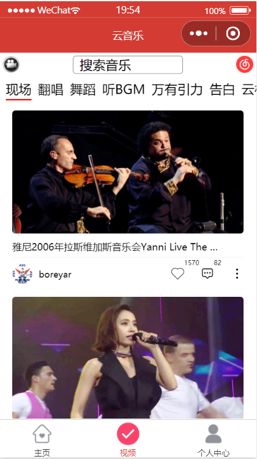

## 一个 Web 音乐应用

- 移动端：

  - 技术栈: Vue ＋ Vant；
  - 应用地址: https://vue3-music-fawn.vercel.app
  - 源码：https://github.com/VikiChan2021/vue3-music

- PC 端：

  - 技术栈: React + AntD；
  - 应用地址: https://163music-lac.vercel.app
  - 源码：https://github.com/VikiChan2021/163music

- 微信小程序：

  - 因版权问题，小程序无法上架，仅提供以下截图
  - 源码：https://github.com/VikiChan2021/wechat-music

